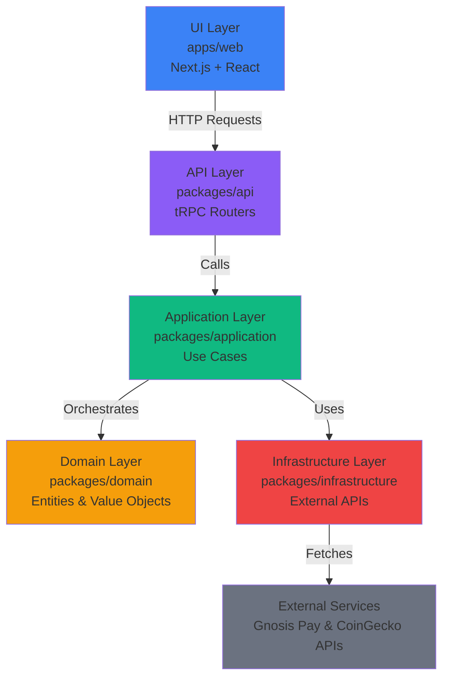
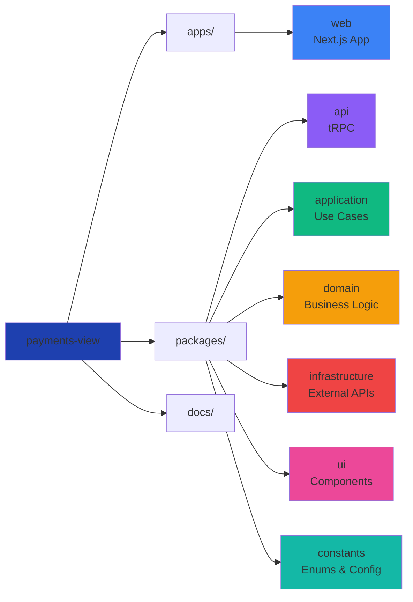

# Finance Dashboard

A comprehensive financial dashboard for Gnosis Pay card users that provides transaction management, visual analytics, and cashback tracking with GNO rewards.

## 📋 Overview

The Gnosis Card Portfolio Dashboard is a modern web application built with Domain Driven Design principles, offering users a complete view of their Gnosis Pay card activity.

### Key Features

- 🔐 **SIWE Authentication** - Secure wallet-based authentication
- 💳 **Transaction Management** - View, search, and filter transactions
- 📊 **Visual Analytics** - Interactive charts and spending breakdowns
- 🎁 **Cashback Tracking** - Monitor GNO-based rewards and optimize staking
- 🤖 **AI Insights** - Natural language queries (coming soon)
- 🌓 **Dark Mode First** - Beautiful dark theme with light mode support

## 🛠️ Tech Stack

- **Runtime**: [Bun](https://bun.sh) v1.3.5
- **Framework**: [Next.js 15](https://nextjs.org) with App Router
- **UI**: [React 19](https://react.dev) + [Tailwind CSS v4](https://tailwindcss.com) + [Shadcn/UI](https://ui.shadcn.com)
- **API**: [tRPC v11](https://trpc.io) for end-to-end typesafe APIs
- **State**: [TanStack Query](https://tanstack.com/query)
- **Blockchain**: [Wagmi](https://wagmi.sh) + [RainbowKit](https://rainbowkit.com)
- **Validation**: [Zod](https://zod.dev)

## 🏗️ Architecture

The project follows Domain Driven Design with a layered architecture:



### Package Structure



## 🚀 Getting Started

### Prerequisites

- **Bun** v1.3.5 or later ([Install Bun](https://bun.sh/docs/installation))
- **Node.js** v20.0.0 or later

### Installation

1. Clone the repository and install dependencies:

```bash
git clone https://github.com/guilhermeendres/payments-view.git
cd payments-view
bun install
```

1. Create `.env.local` in `apps/web`:

```bash
NEXT_PUBLIC_WALLET_CONNECT_PROJECT_ID=your_walletconnect_project_id
```

Get your WalletConnect Project ID from [WalletConnect Cloud](https://cloud.walletconnect.com/).

1. Start the development server:

```bash
bun dev
```

The application will be available at [http://localhost:3000](http://localhost:3000)

## 📜 Available Scripts

```bash
bun dev              # Start development server
bun run build         # Build all packages
bun run lint          # Lint all packages
bun run typecheck     # Type check all packages
bun test              # Run all tests
```

## 🔐 Environment Variables

| Variable | Required | Description |
|----------|----------|-------------|
| `NEXT_PUBLIC_WALLET_CONNECT_PROJECT_ID` | ✅ Yes | WalletConnect project ID |
| `NEXT_PUBLIC_GNO_PRICE_EUR` | ❌ No | GNO price in EUR (fetched from CoinGecko if not set) |

## 🧪 Testing

```bash
bun test              # Run all tests
bun test --watch      # Watch mode
bun test --coverage   # With coverage
```

## 🚢 Deployment

Deploy to Vercel - see [deployment.md](./docs/deployment.md) for details. The project is pre-configured for Vercel with Bun support.

## 🤝 Contributing

Contributions are welcome! Please follow these guidelines:

1. Search the codebase for existing code
2. Follow DDD architecture layers
3. Write tests for new code
4. Run `bun run lint` before committing
5. Follow [Conventional Commits](https://www.conventionalcommits.org/)

### Code Standards

- Max 500 lines per file, 30 lines per function
- Strict TypeScript (no `any`)
- Use enums from `@payments-view/constants`
- Extract business logic to hooks

### Security

For security vulnerabilities, please see our [Security Policy](./SECURITY.md) for responsible disclosure guidelines.

## 📚 Documentation

- **[Architecture](./docs/architecture.md)** - Technical architecture and DDD patterns
- **[Design](./docs/design.md)** - Design system and UI guidelines
- **[Deployment](./docs/deployment.md)** - Deployment guide for Vercel

## 🔗 Resources

- [Gnosis Pay API Docs](https://docs.gnosispay.com/api-reference/intro)
- [Next.js Docs](https://nextjs.org/docs)
- [tRPC Docs](https://trpc.io/docs)
- [Bun Docs](https://bun.sh/docs)

---

**Built with ❤️ using Bun, Next.js, and Domain Driven Design**
